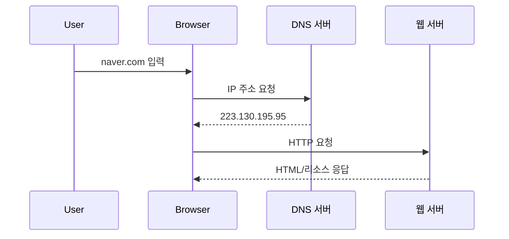

## 인터넷 주소 체계란?

인터넷 주소 체계는 **컴퓨터와 서버가 서로를 정확히 찾아 통신**하도록 설계된 규칙 모음입니다. 핵심 요소는 **IP 주소**, **도메인 네임**, 그리고 이 둘을 연결해 주는 **DNS**(Domain Name System)입니다. 인터넷 프로토콜(TCP/IP·HTTP·FTP 등) 위에서 동작하며, *데이터가 길을 잃지 않도록 안내*합니다.

------

## 프로토콜(Protocol): 디지털 대화 규약

### 왜 프로토콜이 필요할까요?

- **형식·순서 통일**: 서로 다른 제조사의 기기도 문제없이 정보 교환
- **오류 제어**: 데이터 손상·중복 전송 방지
- **확장성**: 새로운 기술이 추가돼도 기본 규칙은 유지

### 대표 인터넷 프로토콜

| **계층**     | **프로토콜**   | **기능**                     |
| ------------ | -------------- | ---------------------------- |
| 전송         | **TCP/IP**     | 연결 지향·데이터 전송의 기본 |
| 애플리케이션 | **HTTP/HTTPS** | 웹 페이지 요청·응답          |
| 애플리케이션 | **FTP/SFTP**   | 파일 업·다운로드             |

> TIP HTTPS(SSL/TLS 암호화)를 사용하면 데이터 도청·변조 위험을 줄일 수 있습니다.

------

## IP 주소: 숫자로 된 인터넷 집 주소

### IPv4 – 32비트 고전 주소

```
예: 202.179.177.2
```

- 0–255 사이 십진수 4개로 구성
- 약 43억 개 제한 → **주소 고갈**

### IPv6 – 128비트 차세대 주소

```
예: 2001:0db8:85a3:0000:0000:8a2e:0370:7334
```

- 16진수 8블록(각 16비트)
- 사실상 **무한대**에 가까운 주소 공간
- IPv4와 **병행 운용** 중

**IPv4 vs IPv6 vs 도메인 네임 요약**

| 구분   | 비트 길이 | 표기 방식                     | 주소 수              |
| ------ | --------- | ----------------------------- | -------------------- |
| IPv4   | 32비트    | 202.179.177.22                | 43억                 |
| IPv6   | 128비트   | 2001:0db8…                    | 3.4×10<sup>38</sup>  |
| 도메인 | –         | [naver.com](http://naver.com) | 사람이 기억하기 쉬움 |

------

## 도메인 네임: 사람이 읽는 문자형 주소

- **호스트명(예: www)** + **도메인(예: example)** + **TLD**(예: .com)
- 기억하기 어려운 숫자 대신 **의미 있는 단어** 사용
- **브랜드 가치**와 **SEO**에도 영향

> example.com처럼 간단·직관적인 도메인은 사용자 신뢰를 높입니다.

------

## DNS(Domain Name System): 주소 번역 서비스

1. 사용자가 **도메인** 입력
2. DNS 서버가 **IP 주소** 조회
3. 브라우저가 해당 **서버**와 연결 → 웹 페이지 렌더링

**작동 흐름**



*DNS 캐싱*으로 **재방문 속도**를 대폭 단축할 수 있지만, IP가 변경된 후엔 **캐시 삭제**가 필요합니다.

------

## FAQ – 인터넷 주소 체계

1. **IP 주소와 도메인은 어떻게 다르죠?**

   IP 주소는 *숫자형 식별자*, 도메인은 *문자형 별칭*입니다.

2. **IPv4에서 IPv6로 언제 완전히 전환되나요?**

   단계적 전환 중이며, **양 체계가 장기간 공존**할 전망입니다.

3. **DNS 캐시를 지우면 어떤 효과가 있나요?**

   오래된 IP 매핑을 제거해 **연결 오류·보안 위험**을 줄입니다.

4. **사설 IP와 공인 IP 차이는?**

   사설 IP는 **로컬 네트워크** 전용, 공인 IP는 **인터넷 전체**에서 고유합니다.

5. **내 도메인을 HTTPS로 바꿔야 하나요?**

   데이터 암호화·SEO·브라우저 신뢰도 향상을 위해 **필수**입니다.
