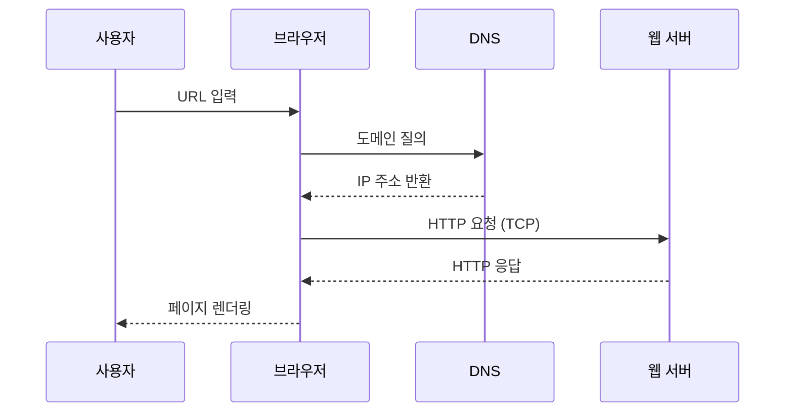

## 웹은 어떻게 우리 눈앞에 페이지를 띄울까?

웹의 동작 원리(**웹 동작 원리**)는 *URL 입력 → DNS 조회 → HTTP 요청/응답*이라는 세 단계로 요약됩니다. 브라우저·DNS·웹 서버가 **TCP/IP** 위에서 협력해 **웹 페이지**를 전송하며, 이 과정 덕분에 우리는 주소만 입력해도 원하는 정보를 바로 확인할 수 있습니다.

------

## 1. URL 입력 – 첫 출발점

- 사용자가 브라우저 주소창에 `www.example.com` 같은 **URL**을 입력
- URL 구성: **프로토콜**(https) + **도메인**([example.com](http://example.com)) + **경로**(/about)

### URL 슬라이싱 예시

```
<https://www.example.com:443/about?lang=ko#section1>
└─┬──┘ └─────┬─────┘  └──┬──┘ └─┬──┘ └──┬──┘
 프로토콜     호스트       포트     경로     앵커
```

------

## 2. DNS 조회 – 사람이 읽는 주소를 IP로 변환

1. **브라우저 캐시** → **OS 캐시** → **로컬 DNS(인터넷 제공업체)** 순서로 IP 검색
2. 캐시에 없으면 루트 → TLD → 권한 있는 DNS까지 **재귀 질의**
3. 결과: `www.example.com → 93.184.216.34`

> Tip: 1.1.1.1, 8.8.8.8 같은 공용 DNS를 사용하면 응답 속도가 개선될 수 있습니다.

------

## 3. HTTP 요청 생성 – TCP 3-Way Handshake 이후 전송

### 📨 요청 패킷 흐름

1. **TCP 연결(3-way)** – SYN / SYN-ACK / ACK
2. **HTTP 요청 라인** – `GET /about HTTP/1.1`
3. **헤더** – Host, User-Agent, Cookie 등
4. **본문(Body)** – 폼 데이터·JSON(POST 요청일 때)

```http
GET /about HTTP/1.1
Host: www.example.com
User-Agent: Mozilla/5.0
Accept: text/html
```

------

## 4. 웹 서버 요청 처리 – 라우팅 & 데이터 준비

- **웹 서버**(Apache, Nginx)가 URL 매핑 → 정적 파일 or 백엔드 로직 실행
- **애플리케이션 서버**(Django, Node.js 등)가 DB 조회·템플릿 렌더링
- 준비된 데이터 → HTTP 응답 메시지로 변환

------

## 5. HTTP 응답 – 브라우저로 돌아오는 데이터

| 구성          | 설명                                    |
| ------------- | --------------------------------------- |
| **상태 라인** | `HTTP/1.1 200 OK`                       |
| **헤더**      | Content-Type, Set-Cookie, Cache-Control |
| **본문**      | HTML, CSS, JS, 이미지, JSON 등          |

> HTTPS라면 TLS 핸드셰이크 후 모든 요청·응답이 암호화되어 전송됩니다.

------

## 6. 렌더링 – 브라우저가 화면을 그리는 과정

1. **HTML 파싱 → DOM 트리**
2. **CSS 파싱 → CSSOM**
3. **DOM + CSSOM → Render Tree**
4. **레이아웃** 계산 → **페인트**
5. JS 실행 & 추가 리렌더링

*크롬 개발자 도구(F12) → Network·Performance 탭으로 세부 타이밍을 확인해 보세요.*

------

## 요약 흐름 다이어그램



------

## FAQ – 웹 동작 원리

1. **HTTP와 HTTPS 차이는?**

   HTTPS는 TLS 암호화로 데이터 무결성과 기밀성을 확보합니다.

2. **DNS 캐시를 지우면 어떤 효과가 있나요?**

   잘못된 IP 매핑을 삭제해 접속 오류를 해결할 수 있습니다.

3. **브라우저가 아닌 앱도 같은 과정을 거치나요?**

   네. 모바일 앱 역시 DNS → TCP → HTTP/S 과정으로 서버와 통신합니다.

4. **CDN을 사용하면 무엇이 달라지나요?**

   **가장 가까운 엣지 서버**에서 콘텐츠를 내려받아 지연 시간이 줄어듭니다.

5. **HTTP/2·HTTP/3는 어떤 장점이 있나요?**

   다중화·헤더 압축(HTTP/2), UDP 기반 QUIC 전송(HTTP/3)으로 속도를 개선합니다.
