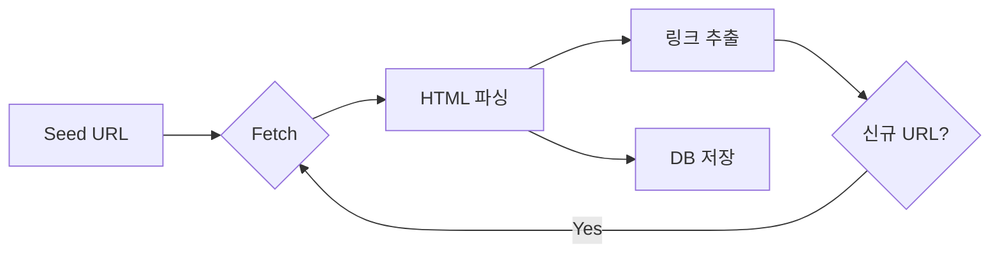

## 검색 엔진의 정의와 등장 배경

인터넷 데이터가 기하급수적으로 늘어나면서 **검색 엔진**(Search Engine)은 사용자가 원하는 정보를 **빠르고 정확**하게 찾도록 도와주는 핵심 시스템이 되었습니다. 초기 목록형 디렉토리에서 **크롤러 기반 자동 수집** 방식으로 진화하며 오늘날 구글·네이버처럼 *로봇 검색* 구조가 표준이 되었습니다.

------

## 검색 엔진의 3단계 동작 원리

### 1. 정보 수집(Crawling)

- 크롤러(봇)가 웹페이지·이미지·영상 등 콘텐츠를 주기적으로 방문
- **robots.txt**·사이트맵을 참고해 접근 가능 경로 결정
- 수집한 원본 데이터는 *데이터베이스*에 저장

### 2. 색인(Indexing)

- HTML 태그·메타데이터·키워드를 분석해 **색인 파일** 생성
- **역색인(Inverted Index)** 구조로 키워드 ↔ 문서 ID 매핑
- 색인 덕분에 수십억 페이지도 **밀리초 단위**로 검색 가능

### 3. 검색 및 랭킹(Search & Ranking)

- 사용자가 쿼리 입력 → 색인에서 **관련 문서 후보** 추출
- **랭킹 알고리즘**(PageRank·AI 모델)이 *품질·연관성* 순으로 정렬
- 개인화·위치·언어를 고려해 최종 **SERP**(검색 결과 페이지) 출력

------

## 검색 엔진의 유형

| 종류               | 특징                    | 대표 서비스          |
| ------------------ | ----------------------- | -------------------- |
| **로봇 검색 엔진** | 크롤러로 자동 수집·색인 | Google, Naver        |
| **디렉토리 검색**  | 사람이 주제별 분류      | 초기 Yahoo!          |
| **메타 검색**      | 여러 엔진 결과 통합     | Dogpile, MetaCrawler |

> LSI 키워드: 서치 엔진, 검색 시스템, 웹 크롤러

------

## 크롤러(Crawler)의 핵심 기능

- **URL 추적**: 링크 그래프를 따라 사이트 전역 탐색
- **중복 제거**: 해시·Etag로 동일 콘텐츠 필터링
- **우선순위 큐**: 인기·갱신 빈도에 따라 재방문 주기를 최적화

------

## 검색 엔진 최적화(SEO) 핵심 전략

### 온페이지(내부) SEO

- **키워드 최적화**: 제목·첫 문단·헤딩에 자연스럽게 배치
- **시맨틱 마크업**: `<h1>–<h3>`, `<strong>`로 구조·중요도 명확화
- **로딩 속도 개선**: 이미지 압축, **Core Web Vitals** 최적화

### 오프페이지(외부) SEO

- **백링크 확보**: 신뢰도 높은 도메인에서 링크 유입
- **소셜 시그널**: 콘텐츠 공유·댓글로 사용자 참여 유도

### 기술 SEO

- **robots.txt & XML 사이트맵** 제출
- **HTTPS**·모바일 친화(Mobile-First Index) 대응

------

## SEO 성공 사례 간단 분석

> 중소 전자상거래 사이트 A사는 제품 리뷰·FAQ를 구조화 데이터로 마크업해 3개월 만에 주요 키워드 TOP 5에 안착, 유입이 120 % 증가했습니다.

------

## FAQ – 검색 엔진 & SEO

1. **크롤러가 내 사이트를 안 가져가면?**

   사이트맵 제출·robots 설정 확인 후 **Fetch as Google**로 즉시 요청하세요.

2. **키워드 밀도는 어느 정도가 적당할까요?**

   전체 단어 대비 **1–2 %** 사이가 자연스러운 수준입니다.

3. **메타 검색 엔진을 활용할 장점은?**

   여러 엔진 결과를 한눈에 비교해 **다양한 관점**을 얻을 수 있습니다.

4. **디렉토리 검색은 왜 쇠퇴했나요?**

   수작업 분류의 **확장성 한계**와 실시간성 부족 때문입니다.

5. **AI 검색이 SEO를 무의미하게 만들까요?**

   아니요. AI 역시 **품질·구조화된 데이터**를 평가하므로 SEO는 여전히 중요합니다.
